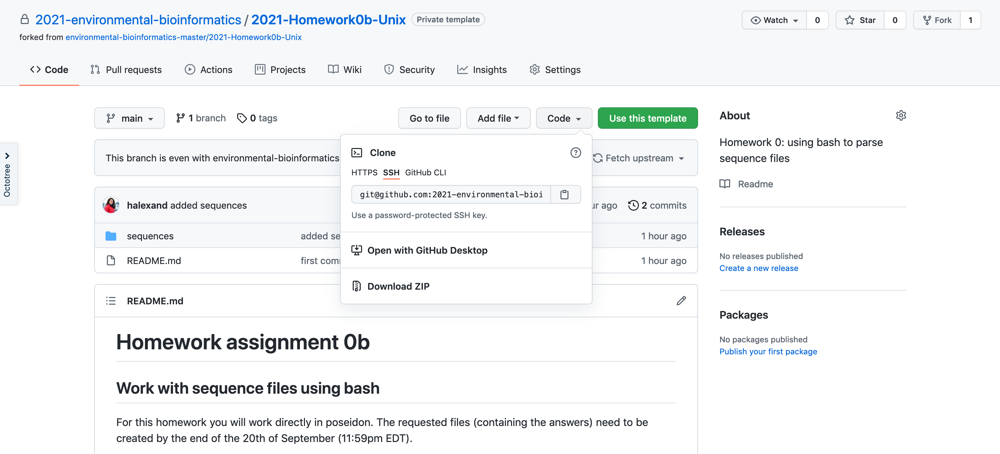
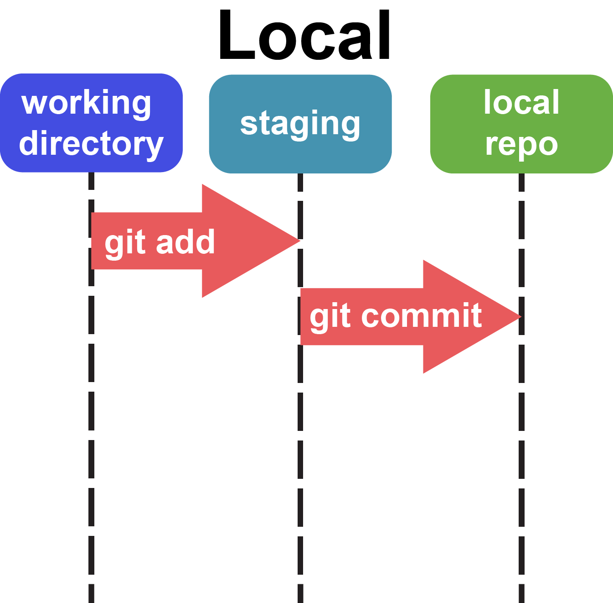
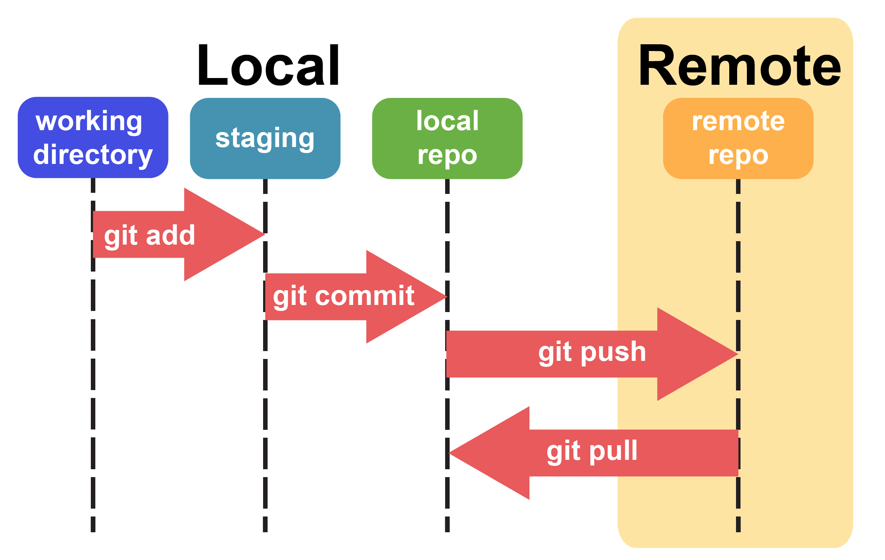
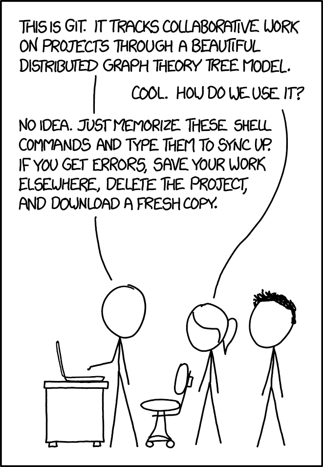

# Introduction to GitHub

### Goals for today: 
**Today we will:**
1. Talk about papers and organizing scientific projects
1. Get GitHub set up on the HPC and your local
2. Get Homework 0 downloaded and setup through GitHub Classrooms
3. Do some Git Practice
4. Finish with some BASH

### GitHub + Homework! 
#### What is Git / GitHub?

Main takeaway:  Git is a software that helps you version control your code. GitHub is a platform that integrates with git and helps you collaborate with others. 

A few other points worth noting: 
- Git is not an archival service
- Git is not a good place to store data or data products (checkout Zenodo or OSF.io)

#### Set up your Git on the HPC
In a future class we will work through GitHub in much more detail. For today, we are just going to get through the basics of getting you set up on the HPC,  downloading the homework, and making commits. 

First, we are going to share a public ssh key between your poseidon account and GitHub. To do this navigate to `~/.ssh/`. Get the contents of the file to print to screen by typing: 

```bash
cat id_rsa.pub
```
Select and copy the whole thing to your local clipboard (on a mac `ctrl+` click). 

Now, we are going to provide this public ssh key to GitHub. Go here: https://github.com/settings/keys and click on `Add new SSH key` on the top left. Give the key a title that is informative for you (like poseidon) and paste your key into the key box. Now click `Add SSH key` at the bottom and you should be good to go!

Now, switch back to terminal, we are going configure our GitHub information on poseidon. All `git` commands run as `git` and then the type of command you want to use. Here it will be `config`

```bash
git config --global user.name "Firstname Lastname" 
git config --global user.email "email@youremail.com"
git config --global core.editor "nano -w"
```

#### Accepting the homework
Let's initiate your homework. Click this link: https://classroom.github.com/a/48DJYTQV. This link is going to take you to GitHub classroom and walk you through the creation of how to create a new repository (repo) that is specific to you. Here, you should be taken to a new repository called `HW_assignment_0b` within our group (`2021-environmental-bioinformatics`). Once you are there, click on the green `Clone or download` buttom at the top. This will lead to a drop down menu which provides the address for the repo. There are several options-- we want to choose `SSH`.  



Once you have copied the address switch back to your terminal window. Navigate to your user directory in posiedon: `/vortexfs1/omics/env-bio/users/yourusername`. We are now going to use the `clone` function of `git`. This is used to clone (or copy) repositories from GitHub to your local machine. Cloning is more than downloading as a zipped file as it will carry with it all the information and metadata that `git` needs to maintain version control. To clone we will type the command: 

```bash
git clone [PASTE THE THING YOU COPIED]
```  
You can then hit enter and you should see some printout like this: 

```
Cloning into 'REPO NAME'...
remote: Enumerating objects: 256, done.
remote: Counting objects: 100% (256/256), done.
remote: Compressing objects: 100% (40/40), done.
remote: Total 256 (delta 0), reused 256 (delta 0), pack-reused 0
Receiving objects: 100% (256/256), 29.52 KiB | 0 bytes/s, done.
```

If you now run `ls` you should see a new folder called `homework0b-unix-username`. Go into this folder and type `ls -a`.  The `-a` flag shows all files (including those that are hidden). Many programs create hidden files (files or folders that start with `.` to prevent users from messing with them). 

What do you see? You should see the homework assignment (`README.md`). The `.md` is markdown file which is a common and relatively easy to use formatting language. You can learn more about it [here](https://guides.github.com/features/mastering-markdown/). 

You should also see a folder called `sequences/` that has some data you will need in it. You will also see a `.git/` folder. This folder contains all the history associated with this repo. Basically, anything that has been committed to GitHub's memory is encoded within the `.git/` folder. 

#### How to use Git to track changes and make commits
There are many levels of expertise that one can have with GitHub. For right now we are going to just cover the basics of the workflow that you might use if you are working on a project on your own. 

After a git has been initiated (either via `git init` or `git clone`, as done here) you can start adding files to be tracked. First off, we have our local repo. Fundamentally, git does not automatically track any files. Files within your working directory are not being followed by git. 


*Local repository schematic* 

Let's make a new file in  our homework directory called `temp`. Using `nano` write something in `temp`, save and the quit out of nano. 
 
To check the status of what files are being followed we can use the command `git status`. This tells us what files are being followed, which aren't, and which have been changed. We can see at the bottom that `temp` is listed as a file that isn't being tracked. To tell git that you want it to follow a file and move it to the staging area you use the command `git add temp`. This will add a file from our working directory to the staging area.  

> Run `git status` again. What changed? 

Git isn't really tracking this file yet. To finalize our changes we need to commit them. This will take our `temp` file that is in the staging area and commit the changes moving it into our local repo. These changes are now remembered by git. 

> Type `git status` again and see what has changed. 

Now, what if make a change to temp. Use `nano` to add some text to `temp`. 
> What happens when you type `git status`? 

As you can see it says that `temp` is tracked-- but it isn't staged staged. In order to stage the file you have to run `git add` and `git commit` again. 

### Linking local Git to a remote (like GitHub)
What if we now wanted to share our changes that we made on our local repo with a remote system like GitHub? There are three main ways of interacting with the remote: 
1. `git clone`: we already used this. This will copy a version of the repo to your local system. 
2. `git pull`: copies changes from a remote repository to a local repository.
3. `git push`:  copies changes from a local repository to a remote repository.



We have all made some changes to our local repositories. Let's try pushing them to the remote. Generally, I find it is good practice to run `git pull` first just in case there have been any changes. This will help you avoid `conflicts`. 

Run `git status`. You can see we are on our `main` branch. We will dive into branches in a later session-- but for right now you can think of `main` as the name of the local repo. By convention, the remote is typically called `origin`. So, to push our current commits to `main` we will type:

```bash
git push main origin 
``` 
Go and take a look at your remote-- you should see that the file `temp` has been added to your online repository. You are now ready to go and work on the homework. Once you are done with the homework you will want to `commit` your changes and `push` them to the remote repository. 

### A parting thought on Git

Starting out with `git` can be a bit overwhelming at times. It is easy to mess up your repo or the like. 

Two common problems: 
1. Accidentally adding files that are over the 100 MB size limit and trying to push them to GitHub. 
2. Conflicting pushes: if you made any changes to your remote Git and forgot while trying to push your local. Thus, always try to pull and then push. 

And honestly, sometimes you just need to start over. Re-clone, move files around, pull and push. However, the simple fact that you can *re-download* a version of your project from the internet is very powerful! 



Cartoon from [XKCD](https://xkcd.com/1597/).
